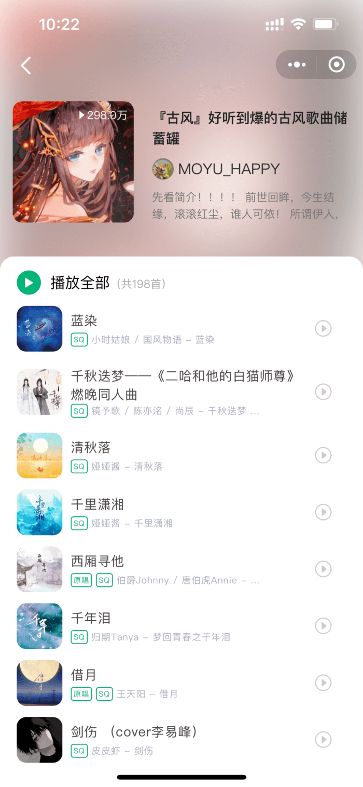
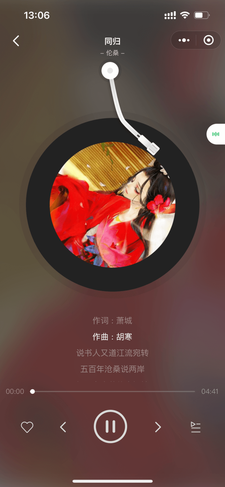
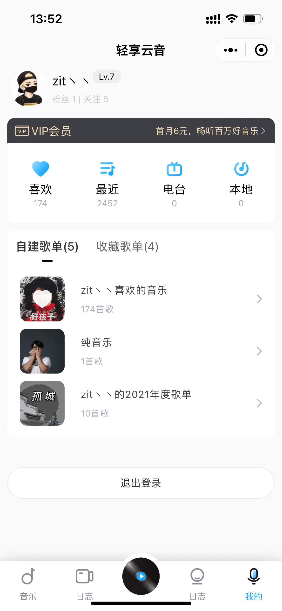

   

<h3 align="center">在线播放音乐的微信小程序</h3>

## ✨   说明

- 技术： 微信小程序

-  API： [网易云音乐 NodeJS 版 API](https://binaryify.github.io/NeteaseCloudMusicApi/#/ "网易云音乐 NodeJS 版 API") 

-  UI参考：  [酷狗音乐重设与思考](https://www.zcool.com.cn/work/ZNDQyMzgyNDg=.html "酷狗音乐重设与思考")

## 🚀 功能

✅ 首页 

✅ 搜索 

✅ 歌单 

✅ 播放器 

✅ 播放动画 

✅ 我的 

✅ 登录 

⬜ 歌手 

⬜ 视频 

⬜ 排行榜 

⬜ 歌词  

... 

## ❤️ 关于上线

- 目前微信暂不允许个人上架音乐类APP

- 可用过微信扫描二维码申请体验版，我看到后会通过的

## 🌈 预览
### 首页
  

### 歌单
  

### 播放
  

<!-- ### 搜索
  
  
### 我的
  -->
